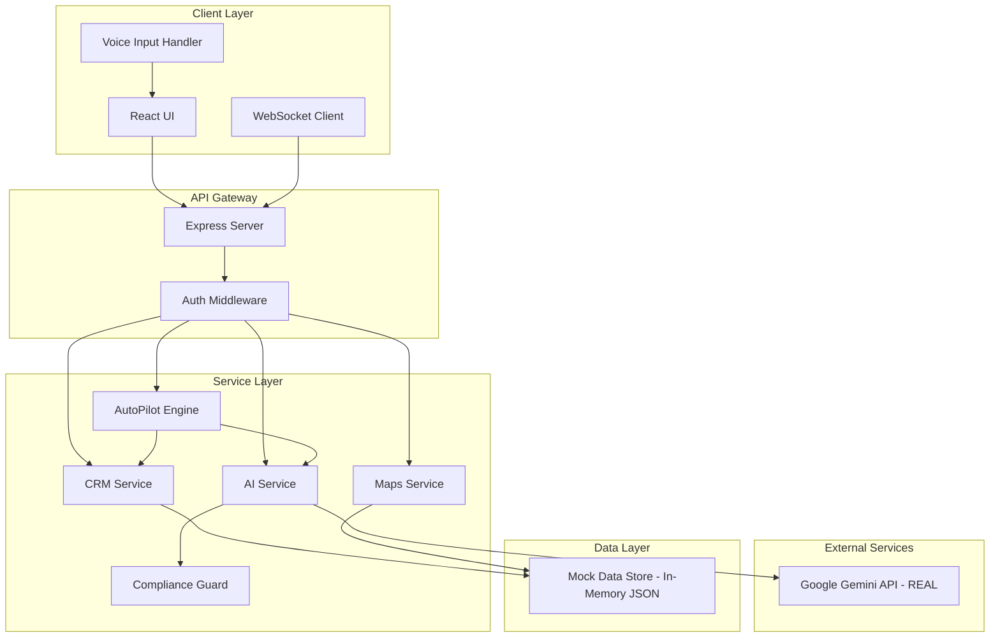

# Design Document

## Overview

The Insurance Agent AI Copilot is a React-based progressive web application (PWA) that combines a modern, minimal UI with Google Gemini AI capabilities. The architecture follows a client-server model with a Node.js backend serving as middleware between the React frontend, Google Gemini API, and the CRM system. The design prioritizes voice-first interactions, real-time AI assistance, IRDAI compliance validation, and autonomous workflow automation through AutoPilot mode.

### Technology Stack

**Frontend:**
- React 18+ with TypeScript (mobile-first responsive design)
- Tailwind CSS for styling (configured with custom design tokens)
- Framer Motion for animations
- React Query for state management and caching
- React Router for navigation
- Web Speech API for voice input with microphone permissions
- Google Maps JavaScript API for mapping features (mock data for MVP)
- PWA configuration for mobile installation

**Backend:**
- Node.js with Express
- **Google Gemini API SDK (REAL - primary AI engine)**
- In-memory data store with mock data (no database for MVP)
- Simple session management (no Redis for MVP)
- WebSocket (Socket.io) for real-time updates

**AI & Compliance:**
- **Google Gemini 1.5 Pro for conversational AI and reasoning (REAL)**
- Custom Compliance Guard middleware (rule-based pattern matching)
- Mock voice transcription (Web Speech API or simulated input)

**MVP Data Strategy:**
- All CRM data: Mock/dummy data in JSON files or in-memory
- All lead interactions: Mock data
- Maps and locations: Mock coordinates and dummy addresses
- Templates: Hardcoded sample templates
- Only Gemini API calls are real

## Architecture

### High-Level Architecture



### Request Flow Patterns

**Pattern 1: Voice Command Flow**
1. User activates voice assistant → Check microphone permission
2. If no permission → Request microphone access → Wait for user approval
3. If permission granted → Voice Input Handler captures audio using Web Speech API
4. Audio transcribed in real-time → Transcript displayed in overlay
5. Transcript sent to AI Service → Gemini extracts intent and entities
6. AI Service routes to appropriate service (CRM, Maps, etc.)
7. Response formatted and returned to UI
8. UI updates with animation and feedback

**Pattern 2: AutoPilot Flow**
1. User enables AutoPilot → AutoPilot Engine fetches prioritized queue
2. For each lead: AutoPilot Engine calls AI Service for Next Best Action
3. AI Service generates action → Compliance Guard validates
4. Action queued in Activity Feed → WebSocket pushes to UI
5. If auto-apply enabled: CRM Service executes → Audit logged
6. If manual approval required: UI displays action card → User approves → CRM Service executes

**Pattern 3: Compliance Validation Flow**
1. AI Service generates content (message, summary, action)
2. Content passed to Compliance Guard middleware
3. Compliance Guard runs pattern matching against IRDAI rules
4. If violation detected: Return flagged phrases + safe alternatives
5. If safe: Return approved content
6. UI displays compliance status badge and tooltip

## Components and Interfaces

### Frontend Components

**1. Global Components**

**CommandBar Component**
```typescript
interface CommandBarProps {
  onCommand: (command: string) => void;
  suggestions: CommandSuggestion[];
  isLoading: boolean;
}

interface CommandSuggestion {
  id: string;
  text: string;
  icon: string;
  action: () => void;
  category: 'navigation' | 'action' | 'search';
}
```

**VoiceAssistant Component**
```typescript
interface VoiceAssistantProps {
  isListening: boolean;
  transcript: string;
  onStart: () => void;
  onStop: () => void;
  language: 'en' | 'hi' | 'mr' | 'ta';
  hasPermission: boolean;
  onRequestPermission: () => Promise<boolean>;
}
```

**SmartContextPanel Component**
```typescript
interface SmartContextPanelProps {
  leadId: string;
  sections: ContextSection[];
}

interface ContextSection {
  type: 'nextAction' | 'objections' | 'templates' | 'compliance' | 'documents';
  data: any;
  isLoading: boolean;
}
```

**NavigationRail Component**
```typescript
interface NavigationRailProps {
  activeRoute: string;
  notificationCount: number;
  onNavigate: (route: string) => void;
}
```

**2. Dashboard Components**

**TodaysBriefingCard Component**
```typescript
interface TodaysBriefingCardProps {
  summary: string[];
  urgentItems: BriefingItem[];
  isLoading: boolean;
}

interface BriefingItem {
  id: string;
  text: string;
  priority: 'high' | 'medium' | 'low';
  action: () => void;
}
```

**WorkZoneCard Component**
```typescript
interface WorkZoneCardProps {
  title: string;
  count: number;
  leads: LeadSummary[];
  onViewAll: () => void;
}

interface LeadSummary {
  id: string;
  name: string;
  temperature: 'hot' | 'warm' | 'cold';
  lastInteraction: string;
}
```

**3. Lead Components**

**LeadCard Component**
```typescript
interface LeadCardProps {
  lead: Lead;
  onClick: () => void;
}

interface Lead {
  id: string;
  name: string;
  age: number;
  location: string;
  tags: string[];
  temperature: 'hot' | 'warm' | 'cold';
  lastInteraction: string;
  avatarUrl?: string;
}
```

**LeadProfile Component**
```typescript
interface LeadProfileProps {
  leadId: string;
  onAction: (action: LeadAction) => void;
}

interface LeadAction {
  type: 'call' | 'whatsapp' | 'message' | 'update';
  payload: any;
}
```

**SentimentGraph Component**
```typescript
interface SentimentGraphProps {
  dataPoints: SentimentDataPoint[];
}

interface SentimentDataPoint {
  date: string;
  score: number; // -1 to 1
  label: string;
}
```

**ConversionGauge Component**
```typescript
interface ConversionGaugeProps {
  probability: number; // 0 to 100
  confidence: number; // 0 to 100
}
```

**4. AI Components**

**NextBestActionCard Component**
```typescript
interface NextBestActionCardProps {
  action: NextBestAction;
  onExecute: () => void;
}

interface NextBestAction {
  id: string;
  title: string;
  steps: string[];
  reasoning: string;
  confidence: number;
  difficulty: 'easy' | 'medium' | 'hard';
  signals: string[];
}
```

**ObjectionPredictorPanel Component**
```typescript
interface ObjectionPredictorPanelProps {
  objections: PredictedObjection[];
  onSelectObjection: (id: string) => void;
}

interface PredictedObjection {
  id: string;
  text: string;
  probability: number;
  safeResponse: string;
  signals: string[];
}
```

**TemplatesPanel Component**
```typescript
interface TemplatesPanelProps {
  templates: MessageTemplate[];
  leadData: Record<string, any>;
  onSelectTemplate: (id: string) => void;
}

interface MessageTemplate {
  id: string;
  name: string;
  category: string;
  content: string;
  dynamicFields: string[];
  channel: 'whatsapp' | 'sms' | 'email';
  isApproved: boolean;
}
```

**ComplianceFlagBadge Component**
```typescript
interface ComplianceFlagBadgeProps {
  violations: ComplianceViolation[];
  onViewDetails: () => void;
}

interface ComplianceViolation {
  phrase: string;
  rule: string;
  severity: 'error' | 'warning';
  suggestion: string;
}
```

**5. AutoPilot Components**

**AutoPilotMiniPanel Component**
```typescript
interface AutoPilotMiniPanelProps {
  isRunning: boolean;
  currentLead: string;
  progress: number;
  nextAction: string;
  onPause: () => void;
  onResume: () => void;
  onAbort: () => void;
}
```

**ActivityFeedPanel Component**
```typescript
interface ActivityFeedPanelProps {
  actions: QueuedAction[];
  onApply: (id: string) => void;
  onEdit: (id: string, changes: any) => void;
  onSkip: (id: string) => void;
  onUndo: (id: string) => void;
}

interface QueuedAction {
  id: string;
  leadId: string;
  leadName: string;
  type: 'crm_update' | 'message' | 'reminder' | 'tag';
  description: string;
  changes: Record<string, any>;
  confidence: number;
  complianceStatus: 'safe' | 'flagged' | 'blocked';
  requiresApproval: boolean;
  timestamp: string;
}
```

**6. Maps Components**

**MapView Component**
```typescript
interface MapViewProps {
  leads: LeadLocation[];
  filters: MapFilter;
  onLeadSelect: (id: string) => void;
  onFilterChange: (filter: MapFilter) => void;
}

interface LeadLocation {
  id: string;
  name: string;
  lat: number;
  lng: number;
  temperature: 'hot' | 'warm' | 'cold';
}

interface MapFilter {
  nearMe: boolean;
  radius: number; // in minutes
  followUpPending: boolean;
  highValue: boolean;
}
```

**RouteOptimizerCard Component**
```typescript
interface RouteOptimizerCardProps {
  selectedLeads: string[];
  route: OptimizedRoute;
  onStartRoute: () => void;
}

interface OptimizedRoute {
  waypoints: Waypoint[];
  totalDistance: number;
  totalTime: number;
  path: google.maps.LatLng[];
}

interface Waypoint {
  leadId: string;
  leadName: string;
  order: number;
  estimatedArrival: string;
}
```

### Backend API Interfaces

**AI Service API**

```typescript
// POST /api/ai/intent
interface IntentRequest {
  text: string;
  context?: {
    leadId?: string;
    currentPage?: string;
  };
}

interface IntentResponse {
  intent: string;
  entities: Record<string, any>;
  confidence: number;
  action: {
    type: string;
    payload: any;
  };
}

// POST /api/ai/summarize
interface SummarizeRequest {
  type: 'call' | 'chat' | 'period';
  content?: string;
  leadId?: string;
  period?: '7d' | '30d';
}

interface SummarizeResponse {
  summary: string[];
  insights: string[];
  nextAction: string;
  entities: Record<string, any>;
  sentiment: number;
}

// POST /api/ai/next-action
interface NextActionRequest {
  leadId: string;
  context: {
    lastInteraction: string;
    temperature: string;
    history: any[];
  };
}

interface NextActionResponse {
  action: NextBestAction;
  complianceStatus: 'safe' | 'flagged';
  violations: ComplianceViolation[];
}

// POST /api/ai/predict-objections
interface PredictObjectionsRequest {
  leadId: string;
  productType: string;
}

interface PredictObjectionsResponse {
  objections: PredictedObjection[];
}
```

**CRM Service API**

```typescript
// GET /api/leads
interface GetLeadsRequest {
  filter?: 'hot' | 'warm' | 'cold' | 'followup' | 'renewal';
  search?: string;
  limit?: number;
  offset?: number;
}

interface GetLeadsResponse {
  leads: Lead[];
  total: number;
}

// GET /api/leads/:id
interface GetLeadResponse {
  lead: LeadDetail;
  interactions: Interaction[];
  sentiment: SentimentDataPoint[];
  conversionProbability: number;
}

interface LeadDetail extends Lead {
  email: string;
  phone: string;
  address: string;
  productInterest: string[];
  premium: number;
  policyNumber?: string;
  documents: Document[];
}

interface Interaction {
  id: string;
  type: 'call' | 'message' | 'meeting' | 'email';
  date: string;
  summary: string;
  sentiment: number;
  duration?: number;
}

// PATCH /api/leads/:id
interface UpdateLeadRequest {
  fields: Partial<LeadDetail>;
  auditInfo: {
    userId: string;
    reason: string;
    source: 'manual' | 'autopilot' | 'ai';
  };
}

interface UpdateLeadResponse {
  success: boolean;
  lead: LeadDetail;
  auditId: string;
}

// POST /api/leads
interface CreateLeadRequest {
  name: string;
  phone: string;
  email?: string;
  source: 'manual' | 'ocr' | 'voice';
  extractedData?: Record<string, any>;
}

interface CreateLeadResponse {
  success: boolean;
  leadId: string;
  lead: Lead;
}
```

**AutoPilot Service API**

```typescript
// POST /api/autopilot/start
interface StartAutoPilotRequest {
  settings: {
    autoApplyCRMUpdates: boolean;
    autoSendMessages: boolean;
    autoOpenProfiles: boolean;
    timeboxMinutes: number;
    confidenceThreshold: number;
  };
}

interface StartAutoPilotResponse {
  sessionId: string;
  queueSize: number;
}

// POST /api/autopilot/pause
interface PauseAutoPilotRequest {
  sessionId: string;
}

// GET /api/autopilot/queue
interface GetQueueResponse {
  actions: QueuedAction[];
  currentIndex: number;
}

// POST /api/autopilot/action/:id/apply
interface ApplyActionRequest {
  actionId: string;
  modifications?: Record<string, any>;
}

interface ApplyActionResponse {
  success: boolean;
  result: any;
  auditId: string;
}

// POST /api/autopilot/action/:id/skip
interface SkipActionRequest {
  actionId: string;
  reason?: string;
}
```

**Compliance Service API**

```typescript
// POST /api/compliance/validate
interface ValidateContentRequest {
  content: string;
  type: 'message' | 'summary' | 'action';
  context?: {
    productType?: string;
    leadId?: string;
  };
}

interface ValidateContentResponse {
  isCompliant: boolean;
  violations: ComplianceViolation[];
  safeAlternative?: string;
  confidence: number;
}
```

**Maps Service API**

```typescript
// GET /api/maps/leads
interface GetLeadLocationsRequest {
  filter: MapFilter;
}

interface GetLeadLocationsResponse {
  leads: LeadLocation[];
  clusters: Cluster[];
}

interface Cluster {
  lat: number;
  lng: number;
  count: number;
  leadIds: string[];
}

// POST /api/maps/optimize-route
interface OptimizeRouteRequest {
  leadIds: string[];
  startLocation?: { lat: number; lng: number };
}

interface OptimizeRouteResponse {
  route: OptimizedRoute;
}
```

## Data Models

### Mock Data Structure (In-Memory for MVP)

**Mock Data Files Location:** `/src/data/mock/`

**users.json** (4 users)
```json
[
  {
    "id": "user-1",
    "email": "rajesh.kumar@example.com",
    "name": "Rajesh Kumar",
    "role": "agent",
    "phone": "+91-9876543210",
    "createdAt": "2024-01-01T00:00:00Z"
  },
  {
    "id": "user-2",
    "email": "anita.desai@example.com",
    "name": "Anita Desai",
    "role": "agent",
    "phone": "+91-9876543220",
    "createdAt": "2024-01-15T00:00:00Z"
  },
  {
    "id": "user-3",
    "email": "vikram.singh@example.com",
    "name": "Vikram Singh",
    "role": "manager",
    "phone": "+91-9876543230",
    "createdAt": "2024-02-01T00:00:00Z"
  },
  {
    "id": "user-4",
    "email": "admin@example.com",
    "name": "System Admin",
    "role": "admin",
    "phone": "+91-9876543240",
    "createdAt": "2024-01-01T00:00:00Z"
  }
]
```

**leads.json** (4 leads with varied temperatures)
```json
[
  {
    "id": "lead-1",
    "name": "Priya Sharma",
    "age": 34,
    "email": "priya.sharma@example.com",
    "phone": "+91-9876543211",
    "location": "Mumbai, Maharashtra",
    "address": "123 MG Road, Andheri, Mumbai",
    "temperature": "hot",
    "tags": ["high-value", "interested", "follow-up"],
    "productInterest": ["Term Life", "Health"],
    "premium": 25000,
    "conversionProbability": 78,
    "lastInteractionSummary": "Discussed term life policy options. Very interested in 1 crore coverage.",
    "lastInteractionDate": "2024-11-13T10:30:00Z",
    "assignedTo": "user-1",
    "lat": 19.0760,
    "lng": 72.8777
  },
  {
    "id": "lead-2",
    "name": "Amit Patel",
    "age": 42,
    "email": "amit.patel@example.com",
    "phone": "+91-9876543212",
    "location": "Pune, Maharashtra",
    "address": "456 FC Road, Shivajinagar, Pune",
    "temperature": "warm",
    "tags": ["renewal-due", "existing-customer"],
    "productInterest": ["Health", "Investment"],
    "premium": 18000,
    "policyNumber": "POL-2023-001",
    "conversionProbability": 62,
    "lastInteractionSummary": "Policy renewal discussion. Considering upgrading health coverage.",
    "lastInteractionDate": "2024-11-10T14:20:00Z",
    "assignedTo": "user-1",
    "lat": 18.5204,
    "lng": 73.8567
  },
  {
    "id": "lead-3",
    "name": "Sneha Reddy",
    "age": 29,
    "email": "sneha.reddy@example.com",
    "phone": "+91-9876543213",
    "location": "Bangalore, Karnataka",
    "address": "789 Indiranagar, Bangalore",
    "temperature": "cold",
    "tags": ["new-lead", "price-sensitive"],
    "productInterest": ["Term Life"],
    "premium": 12000,
    "conversionProbability": 35,
    "lastInteractionSummary": "Initial contact. Requested quotes but concerned about premium costs.",
    "lastInteractionDate": "2024-11-08T09:15:00Z",
    "assignedTo": "user-2",
    "lat": 12.9716,
    "lng": 77.5946
  },
  {
    "id": "lead-4",
    "name": "Rahul Mehta",
    "age": 38,
    "email": "rahul.mehta@example.com",
    "phone": "+91-9876543214",
    "location": "Delhi, NCR",
    "address": "321 Connaught Place, New Delhi",
    "temperature": "hot",
    "tags": ["high-value", "urgent", "family-plan"],
    "productInterest": ["Term Life", "Health", "Child Education"],
    "premium": 45000,
    "conversionProbability": 85,
    "lastInteractionSummary": "Ready to purchase comprehensive family plan. Needs proposal by tomorrow.",
    "lastInteractionDate": "2024-11-13T16:45:00Z",
    "assignedTo": "user-1",
    "lat": 28.6139,
    "lng": 77.2090
  }
]
```

**interactions.json** (4 interactions)
```json
[
  {
    "id": "int-1",
    "leadId": "lead-1",
    "userId": "user-1",
    "type": "call",
    "summary": "Customer interested in term life insurance with 1 crore coverage",
    "transcript": "Agent: Hello Priya, this is Rajesh from XYZ Insurance...",
    "sentiment": 0.7,
    "duration": 420,
    "createdAt": "2024-11-13T10:30:00Z"
  },
  {
    "id": "int-2",
    "leadId": "lead-2",
    "userId": "user-1",
    "type": "message",
    "summary": "Sent renewal reminder and upgrade options",
    "transcript": null,
    "sentiment": 0.5,
    "duration": null,
    "createdAt": "2024-11-10T14:20:00Z"
  },
  {
    "id": "int-3",
    "leadId": "lead-3",
    "userId": "user-2",
    "type": "email",
    "summary": "Sent term life quotes with different coverage options",
    "transcript": null,
    "sentiment": 0.3,
    "duration": null,
    "createdAt": "2024-11-08T09:15:00Z"
  },
  {
    "id": "int-4",
    "leadId": "lead-4",
    "userId": "user-1",
    "type": "meeting",
    "summary": "In-person meeting to discuss comprehensive family insurance plan",
    "transcript": "Discussed term life, health, and child education plans...",
    "sentiment": 0.9,
    "duration": 1800,
    "createdAt": "2024-11-13T16:45:00Z"
  }
]
```

**templates.json** (4 templates)
```json
[
  {
    "id": "tmpl-1",
    "name": "Policy Renewal Reminder",
    "category": "Renewal",
    "content": "Hi {{name}}, your policy {{policyNumber}} is due for renewal on {{dueDate}}. Premium: ₹{{premium}}. Reply YES to renew.",
    "channel": "whatsapp",
    "dynamicFields": ["name", "policyNumber", "dueDate", "premium"],
    "isApproved": true
  },
  {
    "id": "tmpl-2",
    "name": "Follow-up After Quote",
    "category": "Follow-up",
    "content": "Hi {{name}}, thank you for your interest in our {{productType}} plan. I've sent the quote to your email. Let me know if you have any questions!",
    "channel": "whatsapp",
    "dynamicFields": ["name", "productType"],
    "isApproved": true
  },
  {
    "id": "tmpl-3",
    "name": "Welcome New Lead",
    "category": "Onboarding",
    "content": "Welcome {{name}}! I'm {{agentName}}, your insurance advisor. I'm here to help you find the right coverage for your needs. When would be a good time to discuss?",
    "channel": "sms",
    "dynamicFields": ["name", "agentName"],
    "isApproved": true
  },
  {
    "id": "tmpl-4",
    "name": "Document Request",
    "category": "Documentation",
    "content": "Hi {{name}}, to proceed with your {{productType}} application, please share: 1) ID proof 2) Address proof 3) Income proof. You can upload via our secure portal.",
    "channel": "email",
    "dynamicFields": ["name", "productType"],
    "isApproved": true
  }
]
```

**auditLog.json** (4 audit entries)
```json
[
  {
    "id": "audit-1",
    "userId": "user-1",
    "actionType": "update_lead",
    "entityType": "lead",
    "entityId": "lead-1",
    "changes": {"temperature": "hot"},
    "source": "autopilot",
    "aiConfidence": 85,
    "aiReasoning": "Recent positive interaction with high engagement",
    "userDecision": "applied",
    "complianceStatus": "safe",
    "createdAt": "2024-11-13T11:00:00Z"
  },
  {
    "id": "audit-2",
    "userId": "user-1",
    "actionType": "send_message",
    "entityType": "interaction",
    "entityId": "int-2",
    "changes": {"templateId": "tmpl-1"},
    "source": "manual",
    "aiConfidence": null,
    "aiReasoning": null,
    "userDecision": "applied",
    "complianceStatus": "safe",
    "createdAt": "2024-11-10T14:20:00Z"
  },
  {
    "id": "audit-3",
    "userId": "user-2",
    "actionType": "create_lead",
    "entityType": "lead",
    "entityId": "lead-3",
    "changes": {"source": "ocr"},
    "source": "ai",
    "aiConfidence": 92,
    "aiReasoning": "Extracted from visiting card with high OCR confidence",
    "userDecision": "applied",
    "complianceStatus": "safe",
    "createdAt": "2024-11-08T09:00:00Z"
  },
  {
    "id": "audit-4",
    "userId": "user-1",
    "actionType": "update_lead",
    "entityType": "lead",
    "entityId": "lead-4",
    "changes": {"tags": ["urgent"]},
    "source": "autopilot",
    "aiConfidence": 78,
    "aiReasoning": "Customer requested proposal by tomorrow",
    "userDecision": "edited",
    "complianceStatus": "safe",
    "createdAt": "2024-11-13T17:00:00Z"
  }
]
```

### In-Memory State Management

**Backend State (Node.js)**
- Store all mock data in memory on server startup
- Load from JSON files in `/src/data/mock/`
- Provide CRUD operations that modify in-memory objects
- Changes persist only during server runtime (reset on restart)
- No caching layer needed for MVP

**Frontend State (React Query)**
- Cache API responses in React Query
- Optimistic updates for better UX
- Automatic refetching on window focus
- No persistent storage needed

## Error Handling

### Error Categories

**1. Client Errors (4xx)**
- 400 Bad Request: Invalid input data
- 401 Unauthorized: Missing or invalid authentication
- 403 Forbidden: Insufficient permissions
- 404 Not Found: Resource doesn't exist
- 422 Unprocessable Entity: Validation failed

**2. Server Errors (5xx)**
- 500 Internal Server Error: Unexpected server error
- 502 Bad Gateway: External service failure (Gemini, CRM)
- 503 Service Unavailable: Service temporarily down
- 504 Gateway Timeout: External service timeout

### Error Response Format

```typescript
interface ErrorResponse {
  error: {
    code: string;
    message: string;
    details?: any;
    timestamp: string;
    requestId: string;
  };
}
```

### Error Handling Strategies

**Frontend Error Handling**
- Network errors: Show retry button with exponential backoff
- Validation errors: Display inline field errors
- AI service errors: Fallback to cached responses or manual mode
- Voice input errors: Show transcript for manual correction
- AutoPilot errors: Pause session and notify user

**Backend Error Handling**
- Gemini API failures: Retry with exponential backoff (max 3 attempts)
- CRM API failures: Queue updates for retry, notify user
- Compliance Guard failures: Fail-safe to blocking mode
- Database errors: Log and return generic error to client
- WebSocket disconnections: Auto-reconnect with exponential backoff

**Compliance Guard Error Handling**
- If Compliance Guard service is down: Block all AI-generated content
- If rule validation fails: Default to manual approval required
- If confidence is low: Flag for human review

## Testing Strategy

### Unit Testing

**Frontend Components**
- Test each component in isolation using React Testing Library
- Mock API calls and external dependencies
- Test user interactions (clicks, inputs, voice commands)
- Test animation triggers and state transitions
- Target: 80% code coverage

**Backend Services**
- Test each service function independently
- Mock external APIs (Gemini, CRM, Maps)
- Test error handling and edge cases
- Test compliance validation logic
- Target: 85% code coverage

### Integration Testing

**API Integration Tests**
- Test complete request/response cycles
- Test authentication and authorization flows
- Test WebSocket connections and real-time updates
- Test AutoPilot workflow end-to-end
- Use test database with seed data

**External Service Integration**
- Test Gemini API integration with real API calls (rate-limited)
- Test Google Maps API integration
- Test Speech-to-Text API integration
- Mock external CRM for testing

### End-to-End Testing

**Critical User Flows**
1. Voice command → Lead creation → Profile view
2. AutoPilot session → Action approval → CRM update
3. Lead search → Map view → Route optimization
4. Template selection → Compliance validation → Message send
5. Call summary → Next action generation → Task creation

**Testing Tools**
- Playwright or Cypress for E2E tests
- Run on staging environment with test data
- Test on multiple browsers (Chrome, Safari, Firefox)
- Test responsive design on mobile devices

### Performance Testing

**Load Testing**
- Simulate 100 concurrent users
- Test AutoPilot with 50 simultaneous sessions
- Test AI service response times under load
- Target: < 2s response time for 95th percentile

**Stress Testing**
- Test system behavior at 2x expected load
- Test graceful degradation when services fail
- Test database connection pool limits

### Compliance Testing

**IRDAI Rule Validation**
- Create test cases for all known risky phrases
- Test Compliance Guard with edge cases
- Verify all AI outputs pass validation
- Test audit log completeness

**Security Testing**
- Test authentication and session management
- Test SQL injection and XSS vulnerabilities
- Test API rate limiting
- Test data encryption at rest and in transit

### Accessibility Testing

**WCAG 2.1 AA Compliance**
- Test keyboard navigation
- Test screen reader compatibility
- Test color contrast ratios
- Test focus indicators
- Use axe-core for automated testing

## Design Decisions and Rationales

### 1. React + TypeScript for Frontend
**Rationale:** Type safety reduces bugs, React ecosystem provides rich component libraries, excellent PWA support, and strong community.

### 2. Node.js Backend as Middleware
**Rationale:** Keeps sensitive Gemini API keys server-side, enables Compliance Guard validation before responses reach client, and provides centralized mock data management.

### 3. Mock Data Instead of Database (MVP)
**Rationale:** Faster development, no database setup required, easy to modify test scenarios, and sufficient for demonstrating AI capabilities. Can migrate to PostgreSQL later.

### 4. In-Memory State Instead of Redis (MVP)
**Rationale:** Simpler architecture for MVP, no external dependencies, and adequate for single-user demo. Can add Redis when scaling to multiple users.

### 5. WebSocket for Real-Time Updates
**Rationale:** AutoPilot requires real-time action streaming, enables instant notification delivery, and provides better UX than polling.

### 6. Compliance Guard as Middleware
**Rationale:** Centralized validation ensures no AI output bypasses compliance, easier to update rules, and provides audit trail.

### 7. Gemini 1.5 Pro over GPT-4
**Rationale:** Longer context window (1M tokens) for full conversation history, better multilingual support for Indian languages, and competitive pricing.

### 8. Framer Motion for Animations
**Rationale:** Declarative API matches React patterns, excellent performance, and supports complex gesture-based interactions.

### 9. Tailwind CSS with Custom Tokens
**Rationale:** Rapid development, consistent design system, small bundle size with purging, and easy customization for brand colors.

### 10. PWA Architecture with Mobile-First Design
**Rationale:** Offline support for field agents, installable on mobile devices, push notification support, reduced app store friction, and optimized for phone screens with touch interactions.

### 11. Web Speech API with Permission Handling
**Rationale:** Native browser support for voice input, no external STT service needed for MVP, automatic language detection, and standard permission flow for microphone access.
